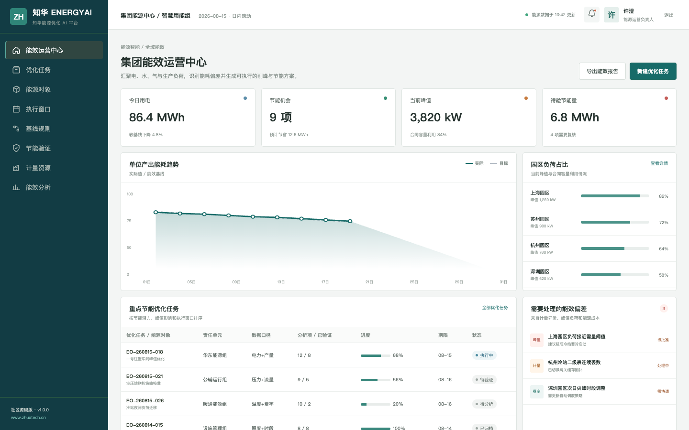
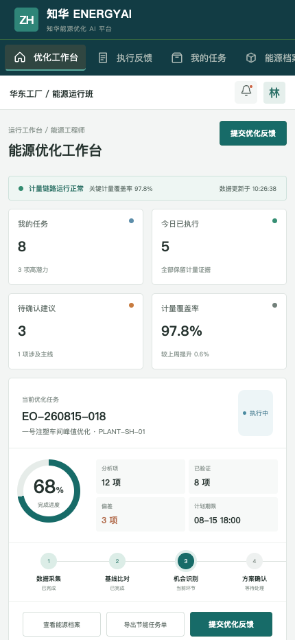

# ZhuaTech EnergyAI · 知华能源优化 AI

> 用可解释的能效分析，把负荷预测、削峰建议和节能验证放进同一个工作闭环。

[](backend/pom.xml) [](backend/pom.xml) [](frontend/package.json) [](compose.yaml) [](LICENSE)

版权所有 © 2026 **上海如静知华信息科技有限公司**。本项目由[知华科技](https://www.zhuatech.cn/)发布，面向个人学习和技术交流提供一套前后端分离的企业能源优化 AI 示例。

## 这套系统解决什么问题

工厂的电表、BMS、生产计划和电价数据往往彼此分散。EnergyAI 将基准能耗、实际用能、峰值负荷、绿电比例和费率组合成可解释的机会评分，给出节能潜力、削峰量与建议动作；涉及生产调度的结果仍由能源负责人审批。



管理端呈现园区能效趋势、峰值负荷、重点优化任务、节能量验证和待处理偏差。



H5 工作台支持任务执行、能源档案、计量状态、现场反馈和偏差升级，适合移动巡查。

## 能力清单

- 园区、介质、计量点与能源基线管理
- 负荷预测、峰谷调度、节能机会排序和碳排核算
- 本地可测试规则输出机会分数、节能潜力、削峰建议和原因解释
- 管理端与响应式 H5 双端工作台，JWT 权限和人工审批门禁
- MySQL + Flyway 数据版本，H2 自动化测试，Docker Compose 交付

核心接口：`POST /api/ai/energy/optimize`。社区版不调用外部大模型，不需要 API Key；接口字段见 [API 文档](docs/api.md)。Java 根包为 `cn.zhuatech.energyai`。

## 快速体验

```bash
cd frontend
npm install
npm run dev:demo
```

访问 `http://localhost:5173`。管理端演示账号 `planner / Demo@2026`，业务端账号 `operator / Demo@2026`；所有园区、人员和能源数据均为虚构演示数据。完整部署见 [deploy/README.md](deploy/README.md)，架构见 [docs/architecture.md](docs/architecture.md)。

## 使用许可

本工程仅能用于个人、非商业性的学习、研究与技术交流，**不得商用**。企业内部使用、生产部署、SaaS、项目交付、收费服务、品牌替换或二次销售，须事先取得上海如静知华信息科技有限公司书面授权，以 [LICENSE](LICENSE) 为准。

能源管理系统、OPC/智能电表接入、AI 模型私有化和深度定制，请访问[知华科技官网](https://www.zhuatech.cn/)或扫码咨询：

| 技术与方案咨询 | 商业授权及定制 |
| --- | --- |
|  |  |

SEO：能源优化 AI、负荷预测、峰谷调度、碳排管理、能源管理系统、Java AI 源码、OPC 技术支持、知华科技、上海如静知华信息科技有限公司。
